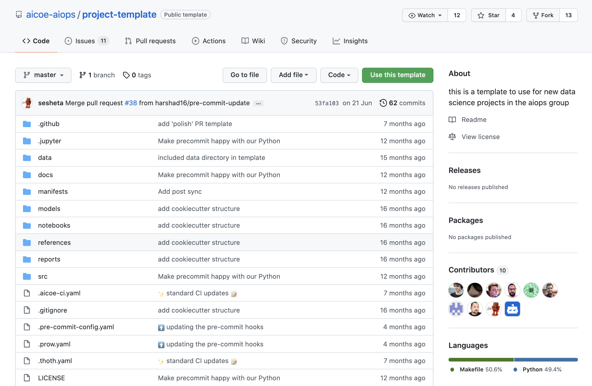
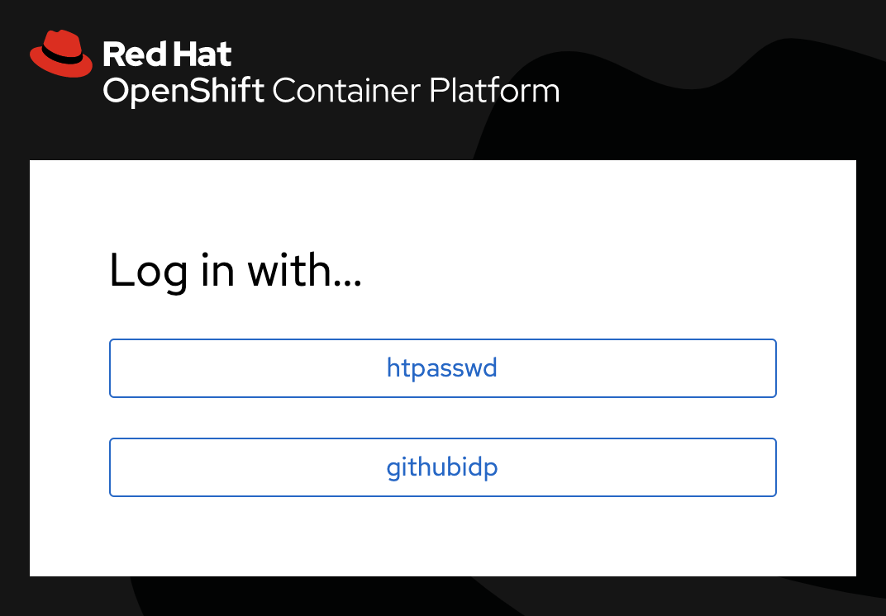
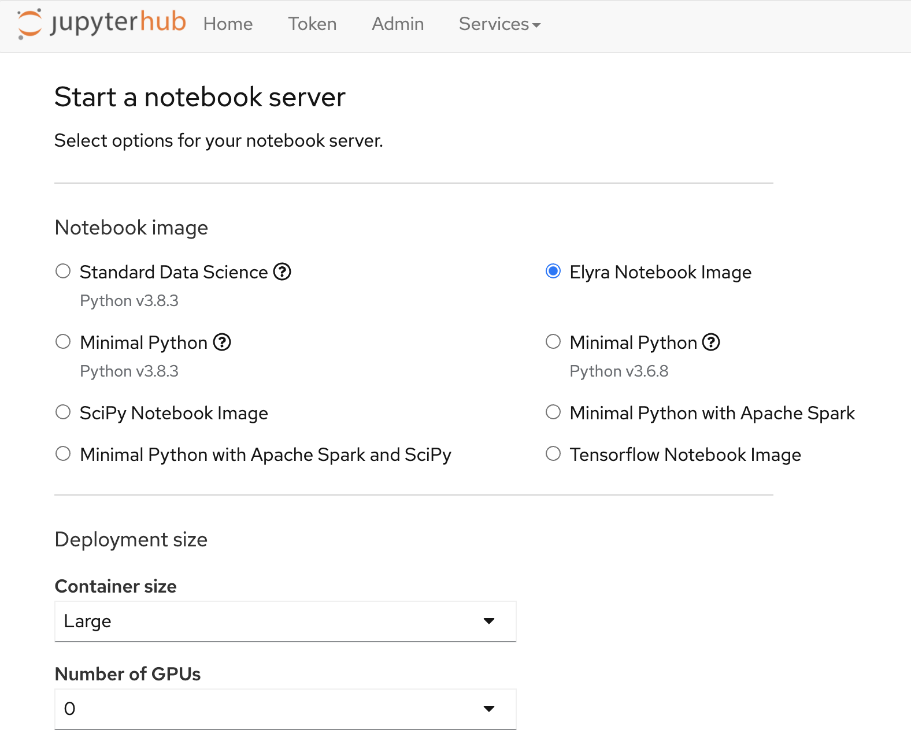
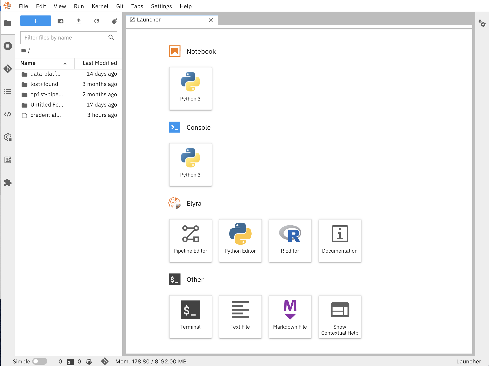
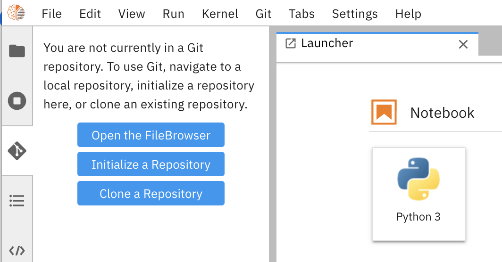

# OS-Climate Data Commons Developer Guide: Setup Initial Environment

This section covers how to  setup your development environment as a contributor to OS-Climate Data Commons developing a data ingestion or processing pipeline. The setup is based around use of OS-Climate GitHub, and a Jupyter Hub / Elyra service provided as a management development platform built to support the needs of our contributors.

## 1. Create new GitHub repository for pipeline development

In order to have a standardized structure that can be easily understood by data scientists, devops engineers and developers, repositories should be created by the on the project template [here][1]. You can click the `Use the template` button provided in the repository and create the structure for your repo this way.

 Having a defined structure in a project ensures all the pieces required for the ML and DevOps lifecycles are present and easily discoverable and allows managing library dependencies, notebooks, test data, documentation, etc. For more information on this topic, we recommend reading and understanding the [Cookiecutter Data Science][2] documentation, on which our standard repository template is inspired.

## 2. Access the development environment with Elyra images on JupyterHub

With your GitHub credentials and once you are part of the team odh-env-users, you will be able to access the development environment.

1. Click this [link][2] to access and select githubidp for authentication.

2. Select the image called `Elyra Notebook Image` and `Large` for container size.

3. Your server should start automatically after a couple of minutes and the Jupyter launcher appear.

## 3. Set your credentials environment variables

From the File menu, create a New text file called credentials.env. The format of this file should be following this template:

    # S3 Credentials for Source Data Landing Zone 
    S3_LANDING_ENDPOINT=https://s3.us-east-1.amazonaws.com
    S3_LANDING_BUCKET=redhat-osc-physical-landing-647521352890
    S3_LANDING_ACCESS_KEY=<replace with the access key provided to you>
    S3_LANDING_SECRET_KEY=<replace with the secret key provided to you>

    # S3 Credentials for Development Data Bucket 
    S3_DEV_ENDPOINT=https://s3.us-east-1.amazonaws.com
    S3_DEV_BUCKET=ocp-odh-os-demo-s3
    S3_DEV_ACCESS_KEY=<replace with the access key provided to you>
    S3_DEV_SECRET_KEY=<replace with the secret key provided to you>

        # Trino Credentials
    TRINO_HOST=trino-secure-odh-trino.apps.odh-cl1.apps.os-climate.org
    TRINO_PORT=443
    TRINO_USER=<your github id>
    TRINO_PASSWD=<your Trino JWT token>

To secure and restrict the access to data based on user profiles, we have defined role-based accessc controls to specific schemas in Trino based on your team assignments. Therefore, authentication with the Trino service has been federated with GitHub SSO and on a weekly basis you will need to retrieve a JWT token from this [Token Retrieval Client][3]. Get the token and cut / paste the token string as your TRINO_PASSWD in the credentials file. 

## 4. Access your repo using Jupyterlab Git Extension

Once you are in the Jupyterlab UI, you can use the Git extension provided to clone this repo.

1. Click the Git extension button from Jupyterlab UI and select `Clone a repository`:

2. Enter the HTTPS address of the repository you want to clone. If it is private and you have access, enter your credentials when requested.

3. You are ready to go!

## Next Step

[Explore notebooks and manage dependencies](./explore-notebooks-and-manage-dependencies.md)

[1]: https://github.com/aicoe-aiops/project-template
[2]: https://jupyterhub-odh-jupyterhub.apps.odh-cl1.apps.os-climate.org/
[3]: https://das-odh-trino.apps.odh-cl1.apps.os-climate.org/
